# Лабораторная работа №2 (со всеми доп. заданиями) — Однослойный перцептрон

Крутилина Анастасия, Б25-507

## Описание

Реализация однослойного перцептрона с нуля на Python (NumPy).  
Без использования PyTorch, TensorFlow, Keras, sklearn.linear_model.

---
# Лабораторная работа №2 — Однослойный перцептрон: реализация, обучение и анализ

## Цель работы
- Реализовать алгоритм обучения однослойного перцептрона с нуля без использования готовых библиотек глубокого обучения.
- Изучить влияние параметров (скорость обучения, количество эпох, размер батча, инициализация весов) на процесс обучения.
- Научиться подготавливать данные для нейронных сетей (нормализация, стратификация).
- Провести анализ полученных результатов, оценить метрики качества и сделать выводы о границах применимости модели.

---

## 1. Подготовка данных и методология

Для эксперимента использовался синтетический датасет, сгенерированный функцией `make_classification` (sklearn) со следующими параметрами: `n_samples=500`, `n_features=2`, `n_redundant=0`, `n_informative=2`, `random_state=42`, `n_clusters_per_class=1`. Задача представляет собой бинарную классификацию в двумерном признаковом пространстве.

**Этапы предобработки:**
1. **Стратифицированное разбиение:** Данные разделены на обучающую (70%) и тестовую (30%) выборки с сохранением исходного баланса классов.
2. **Z-нормализация:** Признаки приведены к нулевому среднему и единичной дисперсии по формуле `x_std = (x - mean) / std`. Параметры нормализации вычислялись исключительно на обучающей выборке и применялись к тестовой для исключения утечки информации.

---

## 2. Реализация перцептрона

Класс `Perceptron` реализован с использованием только библиотеки NumPy:

- **Инициализация:** Веса `w` инициализируются малыми случайными значениями из распределения `N(0, 0.01)`, смещение `b` — нулём.
- **Функция активации:** Сигмоида `sigmoid(z) = 1 / (1 + exp(-z))`.
- **Прямой проход:** `forward(X)` вычисляет вероятности принадлежности к положительному классу.
- **Функция потерь:** Бинарная кросс-энтропия.
- **Обучение:** Mini-batch Gradient Descent с сохранением истории потерь.
- **Предсказание:** Пороговое преобразование (порог 0.5) выходов сигмоиды в бинарные метки.

---

## 3. Обязательная часть: результаты

### 3.1 Базовое обучение

Гиперпараметры: `lr=0.1`, `epochs=100`, `batch_size=32`.

| Выборка | Accuracy |
|---------|----------|
| Обучающая | 0.8657 |
| Тестовая | 0.8867 |

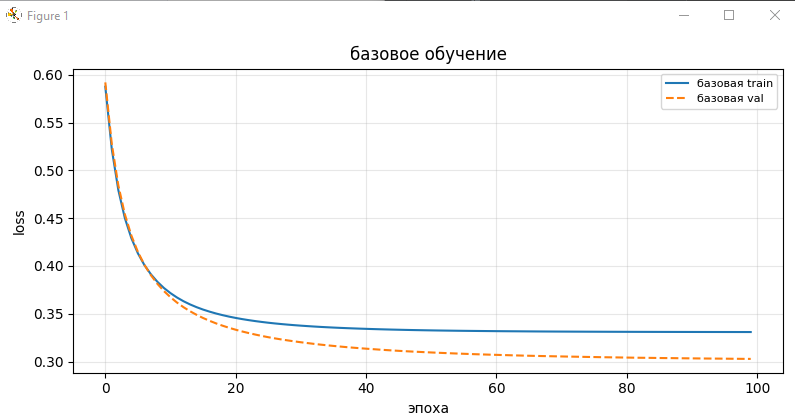

*Динамика функции потерь и разделяющая граница на тестовых данных.*

### 3.2 Влияние скорости обучения

| lr | Train Acc | Test Acc |
|----|-----------|----------|
| 0.001 | 0.8571 | 0.8800 |
| 0.01 | 0.8600 | 0.8867 |
| 0.5 | 0.8629 | 0.8867 |
| 1.0 | 0.8657 | 0.8867 |

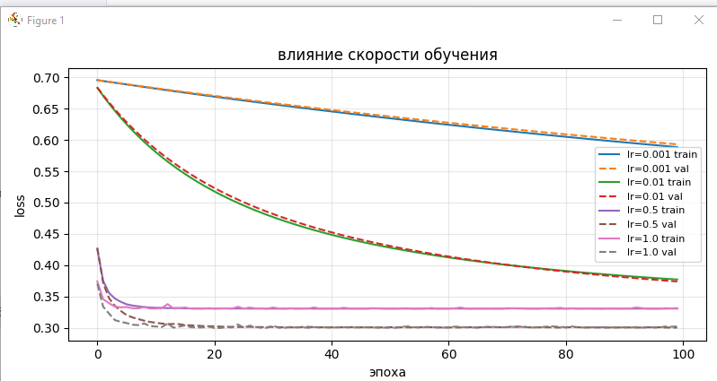

**Вывод:** Слишком малый lr замедляет сходимость. Значения 0.1–1.0 обеспечивают сопоставимую точность, оптимально — 0.1–0.5.

### 3.3 Влияние размера батча

| Batch Size | Train Acc | Test Acc |
|------------|-----------|----------|
| 1 | 0.8714 | 0.8800 |
| 16 | 0.8657 | 0.8867 |
| 64 | 0.8657 | 0.8867 |
| 256 | 0.8629 | 0.8867 |

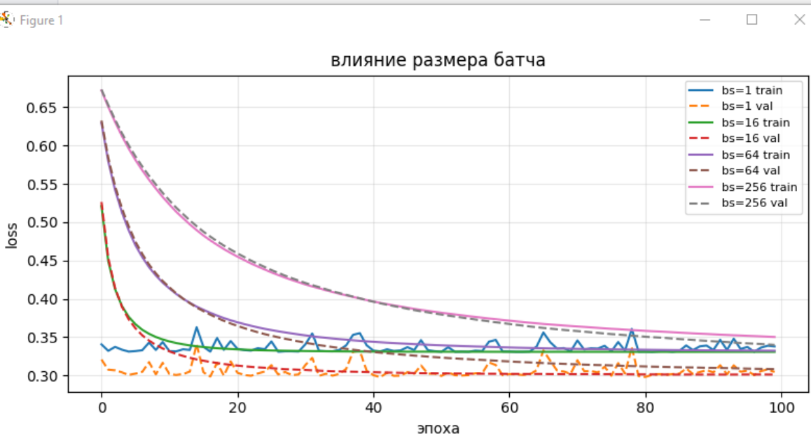

**Вывод:** Batch size 16–32 обеспечивает баланс между шумом градиента и скоростью обучения.

### 3.4 Влияние инициализации весов

| Инициализация | Train Acc | Test Acc |
|---------------|-----------|----------|
| Zeros | 0.8686 | 0.8867 |
| Small Random | 0.8686 | 0.8867 |
| Large Random | 0.8686 | 0.8867 |

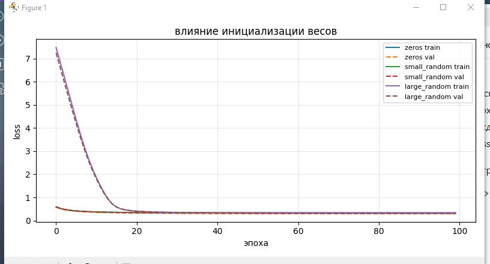

**Вывод:** В данной задаче все стратегии сошлись к близким результатам. Для общих случаев рекомендуется малая случайная инициализация.

---

## 4. Дополнительные задания

### 4.1 Генератор синтетических данных

| Тип данных | Train Acc | Test Acc |
|------------|-----------|----------|
| Линейный | 0.9571 | 0.9400 |
| XOR | 0.6086 | 0.4867 |
| Окружность | 0.6914 | 0.6267 |

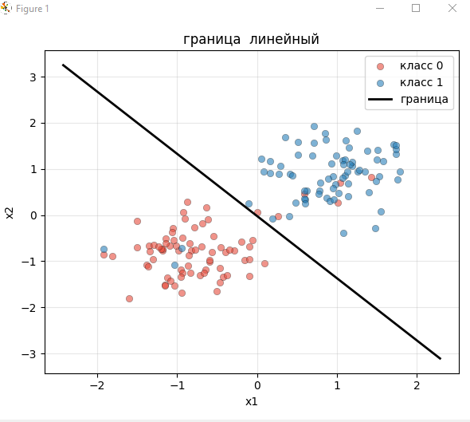
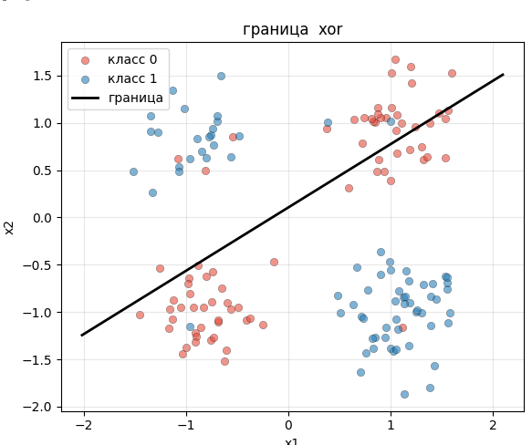
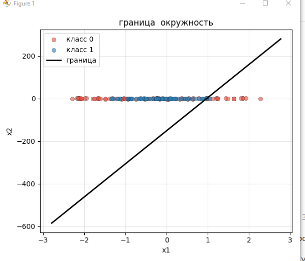

**Вывод:** Перцептрон эффективен только для линейно разделимых задач.

### 4.2 Hinge Loss и L2-регуляризация

**Hinge Loss:** Train Acc = 0.9000, Test Acc = 0.9200.

**L2-регуляризация:**

| λ | Train Acc | Test Acc | ‖w‖ (норма весов) |
|---|-----------|----------|------------------|
| 0.0 | 0.8657 | 0.8867 | 3.1511 |
| 0.01 | 0.8629 | 0.8867 | 2.4839 |
| 0.1 | 0.8571 | 0.8867 | 1.2091 |
| 1.0 | 0.8571 | 0.8800 | 0.2868 |

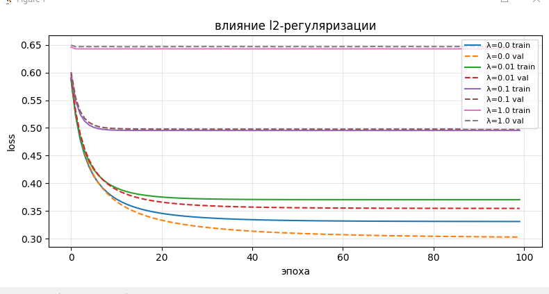

### 4.3 Метрики качества

| Метрика | Значение |
|---------|----------|
| Accuracy | 0.8867 |
| Precision | 0.8537 |
| Recall | 0.9333 |
| F1-Score | 0.8917 |
| ROC-AUC | 0.9402 |

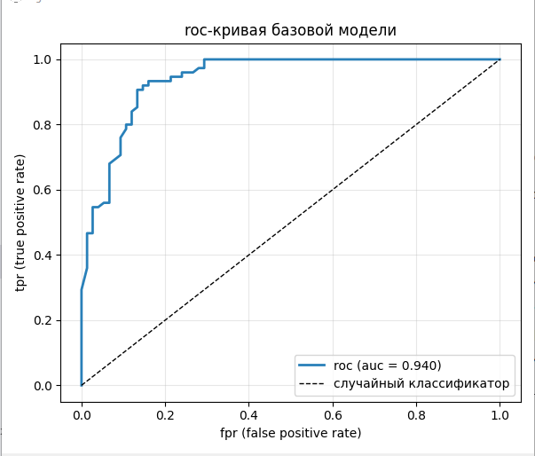
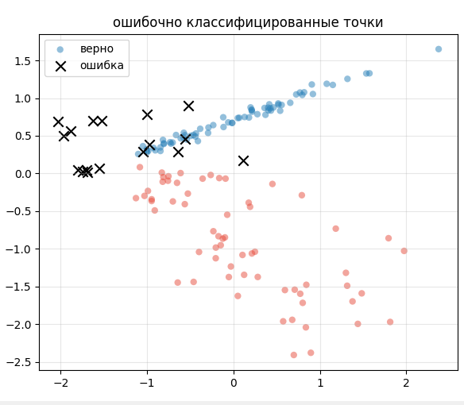

### 4.4 Momentum SGD

| β | Train Acc | Test Acc |
|---|-----------|----------|
| 0.5 | 0.8657 | 0.8867 |
| 0.9 | 0.8686 | 0.8867 |
| 0.99 | 0.8657 | 0.8867 |

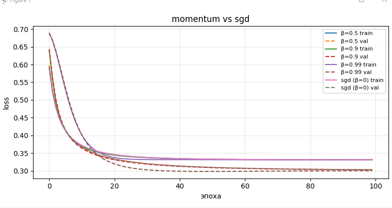

**Вывод:** β=0.9 обеспечивает оптимальное ускорение сходимости.

### 4.5 Кросс-валидация

Лучшие параметры: `lr=0.5`, `batch_size=32`.  
Средняя точность: 0.8780 ± 0.0248.  
Финальная модель: Accuracy = 0.8740.

---

## 5. Общие выводы

1. Однослойный перцептрон успешно решает задачи линейной классификации (Accuracy ~88%, AUC = 0.94).
2. Оптимальные гиперпараметры: lr = 0.1–0.5, batch_size = 16–32, малая случайная инициализация весов.
3. Модель не способна решать нелинейные задачи (XOR, окружность), что подтверждает теоретические ограничения линейных классификаторов.
4. L2-регуляризация контролирует сложность модели, уменьшая норму весов без существенной потери точности при λ = 0.01–0.1.
5. Использование момента (β = 0.9) ускоряет сходимость градиентного спуска.
6. Кросс-валидация позволяет надёжно подбирать гиперпараметры и оценивать обобщающую способность.

---

## Структура проекта

    lab1/
    ├── model/
    │   └── perceptron.py     # класс перцептрона: sigmoid, forward, fit, predict, loss
    ├── data/
    │   └── dataset.py        # загрузка данных, стратификация, z-нормализация
    ├── extras/
    │   ├── generator.py      # генератор синтетических данных (доп. задание 1)
    │   ├── losses.py # hinge loss и l2-регуляризация (доп. задание 2)
    │   ├── metrics.py # precision, recall, f1, roc-auc, roc-кривая (доп. задание 3)
    │   ├── momentum.py # градиентный спуск с моментом (доп. задание 4)
    │   └── crossval.py # кросс-валидация и подбор гиперпараметров (доп. задание 5)
    ├── utils/
    │   └── plots.py          # все функции для построения графиков
    ├── main.py               # точка входа, все эксперименты
    └── README.md

---
## Запуск

```bash
pip install numpy matplotlib scikit-learn
python main.py
```

---

## Обязательная часть

- Подготовка данных: `make_classification`, стратификация 70/30, z-нормализация
- Класс `Perceptron`: sigmoid, forward, compute_loss, fit (мини-батчи), predict
- Базовое обучение: η=0.1, epochs=100, batch_size=32
- Эксперименты: влияние lr, batch_size, инициализации весов

